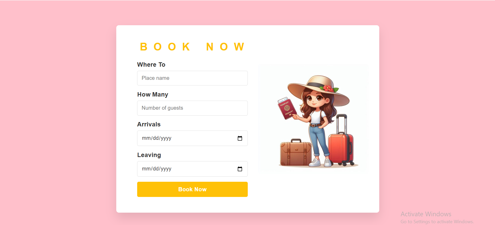
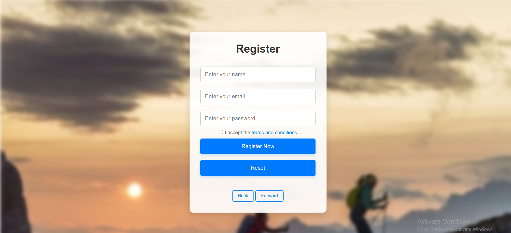

# 🌍 Travel & Tourism Website

A responsive Travel & Tourism website built using **HTML, CSS, and JavaScript**. This project was developed as part of my Diploma in Information Technology to demonstrate front-end web development skills.

## ✨ Features

- 🏠 Home Page
- ✈️ Tour Packages
- 📅 Booking Page
- 🔐 Login Page
- 🛎️ Services Page
- 📱 Responsive Design
- 🖼️ Image & Video Gallery

## 🛠️ Technologies Used

- HTML5
- CSS3
- JavaScript

## 📁 Project Structure

```
HTML/
Images/
Video/
README.md
```

## 🚀 How to Run

1. Download or clone this repository.
2. Open the **HTML** folder.
3. Open **index.html** in your browser.

## 📸 Project Screenshots

## 📸 Project Screenshots

### Home Page


### Packages Page


### Booking Page



### Login Page




## 👩‍💻 Author

**Arpita Desai**

Diploma in Information technology

## 📄 License

This project is shared for portfolio and educational purposes only.

© 2026 Arpita Desai. All Rights Reserved.
Last updated: July 2026